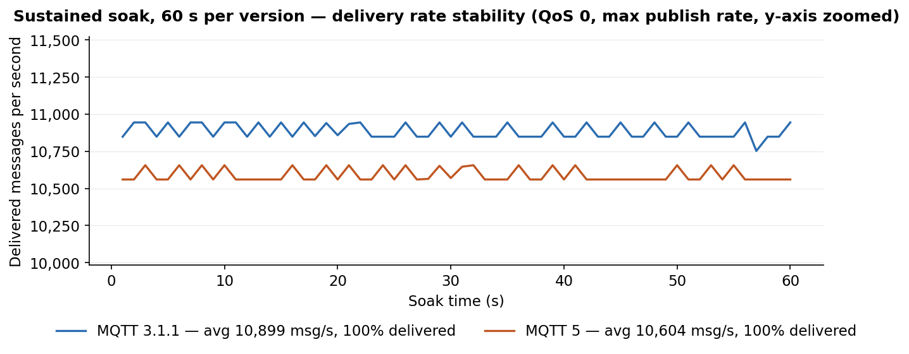
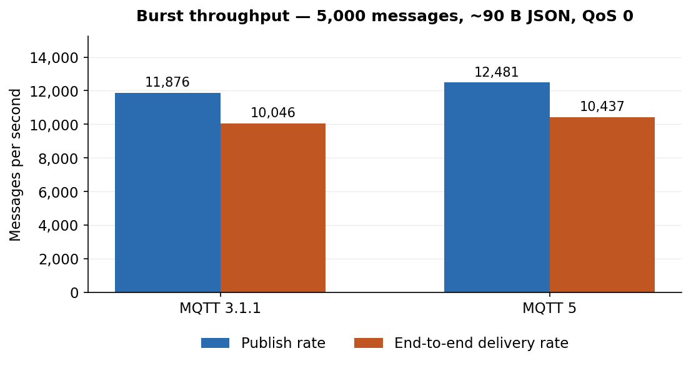
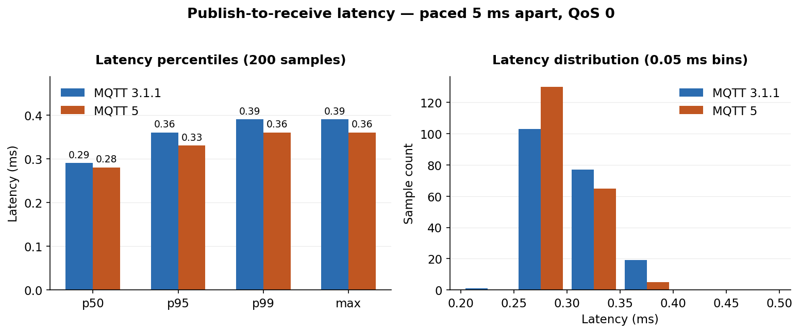

# MQTT Broker Conformance Report

| Field | Value |
| --- | --- |
| **Device** | NetBurner SOMRT1061 at `172.16.82.8` (TCP 1883) |
| **Run** | 2026-07-11 14:11:32 |
| **Result** | **28/28 tests passed** |
| **Soak** | 1,290,210 messages / 120 s — 100% delivered |

> Both protocol versions pass every conformance check. Sustained soaks show flat delivery rates with zero parser errors, slow-consumer disconnects, pool exhaustion, or quota drops.

## Sustained soak



| Metric | MQTT 3.1.1 | MQTT 5 |
|---|---|---|
| Duration | 60 s | 60 s |
| Published | 653,956 | 636,254 |
| Delivered | 653,956 (100.0%) | 636,254 (100.0%) |
| Average rate | 10,899 msg/s | 10,604 msg/s |
| Parser errors | 0 | 0 |
| Slow-consumer disconnects | 0 | 0 |
| Pool exhaustion | 0 | 0 |
| Quota / size drops | 0 / 0 | 0 / 0 |

## Conformance results

_Durations include intentional waits (keep-alive expiry, retained-delete settling), not broker processing time._

| Test | MQTT 3.1.1 status | MQTT 3.1.1 duration | MQTT 5 status | MQTT 5 duration |
| --- | :---: | ---: | :---: | ---: |
| CONNECT / CONNACK wire format | PASS | 3.2 ms | PASS | 11.9 ms |
| PINGREQ / PINGRESP | PASS | 1.3 ms | PASS | 15.9 ms |
| QoS 0 publish and subscribe | PASS | 2.6 ms | PASS | 16.9 ms |
| QoS 1 publish with PUBACK format check | PASS | 34.3 ms | PASS | 15.4 ms |
| QoS 2 four-packet handshake, both directions | PASS | 1.0 s | PASS | 1.0 s |
| Retained message: set, deliver, delete | PASS | 1.7 s | PASS | 1.6 s |
| Will published on abrupt disconnect | PASS | 52.4 ms | PASS | 48.7 ms |
| Wildcard filters (`+` and `#`) | PASS | 12.6 ms | PASS | 29.4 ms |
| UNSUBSCRIBE stops delivery | PASS | 1.0 s | PASS | 1.0 s |
| Session persistence across reconnect | PASS | 1.0 s | PASS | 1.0 s |
| Keep-alive enforcement (1.5× timeout) | PASS | 6.5 s | PASS | 6.5 s |
| 4 KB payload integrity | PASS | 4.7 ms | PASS | 27.4 ms |

### Cross-version interoperability

| Scenario | Status | Duration |
| --- | :---: | ---: |
| MQTT 5 publisher → 3.1.1 subscriber (properties stripped) | PASS | 12.9 ms |
| 3.1.1 publisher → MQTT 5 subscriber | PASS | 15.2 ms |
| Retained by MQTT 5, consumed by 3.1.1 | PASS | 325.8 ms |
| QoS 1 delivery across versions | PASS | 31.2 ms |

## Performance benchmarks





| Metric | MQTT 3.1.1 | MQTT 5 |
|---|---|---|
| Burst publish rate | 11,876 msg/s | 12,481 msg/s |
| End-to-end delivery rate | 10,046 msg/s | 10,437 msg/s |
| Delivery completeness | 5000/5000 | 5000/5000 |
| Latency p50 / p95 / p99 | 0.29 / 0.36 / 0.39 ms | 0.28 / 0.33 / 0.36 ms |
| Latency worst sample | 0.39 ms | 0.36 ms |

## Coverage

| Area | Checks |
| --- | --- |
| Connection | CONNECT/CONNACK wire format (2-byte vs property-bearing) |
| QoS | 0, 1, and full QoS 2 four-packet exchange both directions |
| Retained | Set, deliver on subscribe, delete |
| Will | Published on abrupt socket loss |
| Subscriptions | `+` / `#` wildcards, UNSUBSCRIBE stops delivery |
| Session | Persistence (CleanSession / Session Expiry Interval) |
| Keep-alive | Broker enforcement at 1.5× negotiated interval |
| Payload | 4 KB integrity |
| Cross-version | Mixed routing, retained, QoS 1; MQTT 5 properties stripped for 3.1.1 |

## Reproduce

```bash
cd platforms/netburner/scripts
python mqtt_conformance_suite.py --host 172.16.82.8 --soak-seconds 60
python generate_conformance_report.py --results mqtt_conformance_results.json \
    --out-dir ../../../docs/reports
```
