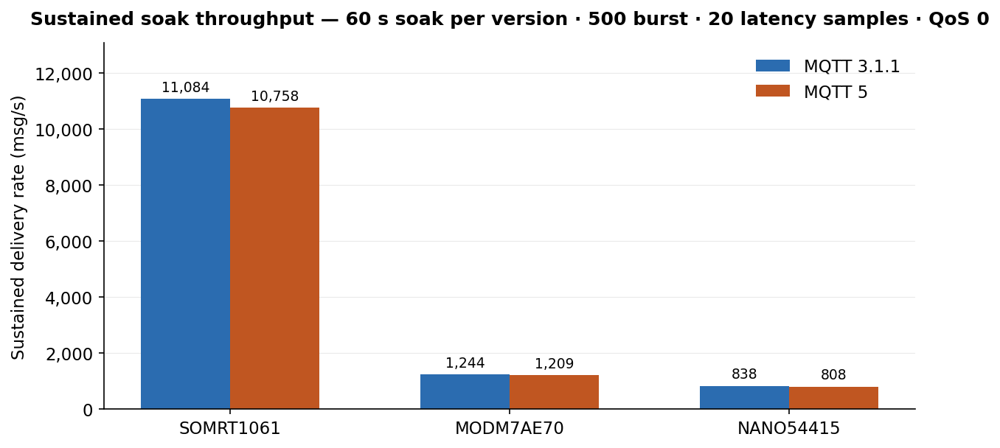
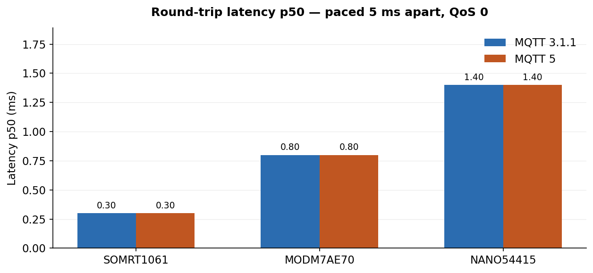

# MQTT Broker — Platform Comparison

**Test profile:** 60 s soak per version · 500 burst · 20 latency samples · QoS 0

**Generated:** 2026-07-11

## Summary

| Platform | Host | CPU | Clock | Conformance | Soak 3.1.1 | Soak MQTT 5 | Latency p50 | Health (soak) | Report |
| --- | --- | --- | --- | --- | --- | --- | --- | --- | --- |
| **SOMRT1061** | `172.16.82.8` | NXP i.MX RT1061 (Arm Cortex-M7) | 528 MHz | **28/28** | 11,084 msg/s | 10,758 msg/s | 0.3 / 0.3 ms | 3.1.1: 0 issues; v5: parser 3, keep-alive 2 | [report](somrt1061_conformance_report.md) |
| **MODM7AE70** | `172.16.82.52` | Microchip SAM E70 (Arm Cortex-M7) | 300 MHz | **28/28** | 1,244 msg/s | 1,209 msg/s | 0.8 / 0.8 ms | 0 issues | [report](modm7ae70_conformance_report.md) |
| **NANO54415** | `172.16.82.55` | Freescale ColdFire MCF54415 | 250 MHz | **28/28** | 838 msg/s | 808 msg/s | 1.4 / 1.4 ms | 0 issues | [report](nano54415_conformance_report.md) |

## Hardware & broker limits

### SOMRT1061

- **CPU:** NXP i.MX RT1061 (Arm Cortex-M7)
- **Clock:** 528 MHz
- **RAM:** 32 MB SDRAM + 1 MB on-chip SRAM
- **Flash:** 8 MB SPI NOR
- **Network:** Dual 10/100 Ethernet
- **Broker limits:** 32 TCP clients · 192 KB payload pool · 64 KB retained

### MODM7AE70

- **CPU:** Microchip SAM E70 (Arm Cortex-M7)
- **Clock:** 300 MHz
- **RAM:** 8 MB SDRAM + 384 KB on-chip SRAM
- **Flash:** 2 MB embedded NOR
- **Network:** 10/100 Ethernet
- **Broker limits:** 16 TCP clients · 72 KB payload pool · 32 KB retained

### NANO54415

- **CPU:** Freescale ColdFire MCF54415
- **Clock:** 250 MHz
- **RAM:** 64 MB DDR2 SDRAM
- **Flash:** 8 MB parallel NOR
- **Network:** 10/100 Ethernet
- **Broker limits:** 32 TCP clients · 128 KB payload pool · 64 KB retained

## Individual reports

- [SOMRT1061 @ 172.16.82.8](somrt1061_conformance_report.md)
- [MODM7AE70 @ 172.16.82.52](modm7ae70_conformance_report.md)
- [NANO54415 @ 172.16.82.55](nano54415_conformance_report.md)
